# BPMN e a gestão de processos curatoriais

## Introdução

A gestão de acervos museológicos enfrenta o desafio de estruturar e documentar processos curatoriais complexos de forma padronizada e eficiente, especialmente no contexto digital. Nesse sentido, o projeto Obatalá – desenvolvido em parceria pelo Instituto Brasileiro de Museus (IBRAM) e o Laboratório Multiusuário de Pesquisa em Redes e Sistemas Computacionais, conhecido como NOCS-Lab, do IFRN Parnamirim – busca a criação de uma solução robusta para a gestão digital de processos curatoriais. Inspirado nas práticas do Museu Paulista da USP e implementado como um plugin do Wordpress, o sistema Obatalá tem como objetivo integrar e otimizar todas as etapas do ciclo curatorial, como patrimoniação, conservação, empréstimo e circulação de itens de acervo, com conformidade aos padrões museológicos estabelecidos.

Atualmente, a equipe está dedicada a estudar a adaptação da notação BPMN (Business Process Model and Notation) para o desenho de fluxos de processos no Obatalá. Este é um passo fundamental para assegurar que a modelagem atenda aos requisitos curatoriais específicos, consolidando o uso da ferramenta BPMN a partir de conceitos consagrados. O desafio está em utilizar ao máximo os elementos que o BPMN oferece, de modo a construir uma base sólida que facilite a comunicação entre todos os envolvidos e garanta o acompanhamento preciso de cada processo curatorial.

A aplicação do BPMN permitirá que o Obatalá documente e monitore os fluxos curatoriais de forma estruturada e transparente, promovendo uma gestão mais racionalizada e segura dos acervos e facilitando o intercâmbio de informações entre instituições. Através dessa abordagem, o projeto não só apoia a preservação do patrimônio cultural, mas também integra tecnologias emergentes e práticas museológicas eficientes, contribuindo para a Política de Metadados estabelecida pelo IBRAM.

## Definições importantes

### Negócio

**Negócio pode ser entendido como o conjunto de atividades organizacionais que produzem valor para clientes, acionistas ou para a própria organização**. Segundo autores como Harmon (2014) e Davenport (1993), um negócio envolve a criação de valor a partir de operações coordenadas, refletindo a estratégia da organização e orientando suas ações. No contexto de BPMN, os negócios são representados por fluxos e atividades que compõem o processo central da organização.

### Processo de negócio
**Um processo de negócio é uma série de atividades inter-relacionadas que convergem para a entrega de um produto ou serviço específico, proporcionando valor para o cliente final**. Conforme Weske (2012), os processos de negócios conectam departamentos e áreas funcionais, criando uma visão mais holística sobre como os resultados são alcançados dentro da organização. No BPMN, esses processos são representados por diagramas que destacam o fluxo de atividades, decisões e interações entre diferentes atores.

### Estrutura funcional versus Processos
**A estrutura funcional refere-se à organização baseada em departamentos específicos (ex.: RH, Marketing), focando em especializações dentro de uma área. Em contrapartida, o enfoque nos processos promove uma visão orientada a fluxos de trabalho que atravessam diversas áreas da empresa, concentrando-se nos resultados para o cliente**. Autores como Hammer e Champy (1993) defendem que, enquanto a estrutura funcional pode levar à eficiência interna, uma abordagem orientada a processos assegura maior eficácia no atendimento às necessidades do cliente, essencial para um BPMN bem implementado. Veja os exemplos de estruturas funcionais e de processos na Fígura abaixo. 

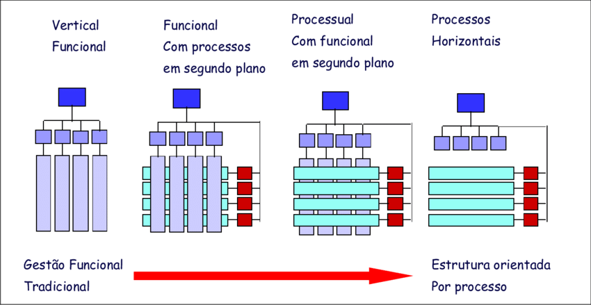

### Tipos de processos
Os processos de negócios geralmente se dividem em três categorias:

- **Primário**: É o processo que gera valor diretamente para o cliente, como produção ou atendimento. Porter (1985) enfatiza que processos primários são centrais na criação de vantagem competitiva.
- **Secundário (ou Suporte)**: Apoia os processos primários, como TI e RH, e não geram valor direto para o cliente, mas sustentam a operação do negócio.
- **Gerencial**: Refere-se à supervisão e controle dos processos da organização, incluindo o planejamento estratégico e o gerenciamento de recursos.

Esses tipos de processos, descritos por Rummler e Brache (1990), organizam as atividades empresariais, destacando quais fluxos impactam diretamente o cliente e quais suportam a eficiência interna.

## O que é BPMN?
**Business Process Model and Notation (BPMN) é uma notação gráfica padronizada utilizada para modelar processos de negócios**. Inicialmente desenvolvida pela Business Process Management Initiative (BPMI) e, a partir de 2005, integrada ao Object Management Group (OMG), a BPMN permite representar graficamente o fluxo e as interações de atividades em processos complexos, de forma compreensível tanto para técnicos quanto para profissionais de negócios. Weske (2012) descreve o BPMN como uma das notações mais amplamente adotadas na modelagem de processos de negócios, devido à sua capacidade de capturar a lógica dos fluxos e de criar uma base comum de entendimento entre diferentes departamentos e stakeholders de uma organização.

**A notação BPMN é composta por uma variedade de elementos visuais – como eventos, atividades e gateways – que facilitam a identificação de pontos-chave em um processo**. Esses elementos permitem detalhar processos de forma organizada, destacando onde decisões são tomadas, onde ocorrem interações entre participantes e onde eventos importantes se manifestam. 

### Importância do BPMN na Modelagem de Processos para Projetos de Curadoria
Em projetos como o Obatalá, que visam a gestão digital de processos curatoriais, a BPMN torna-se uma ferramenta essencial. De acordo com Recker (2010), **o uso da BPMN promove a consistência e a rastreabilidade dos processos, reduzindo ambiguidades e melhorando a comunicação entre os envolvidos no projeto**. No contexto da curadoria de museus, onde atividades como patrimoniação, conservação e empréstimo de acervos são processos contínuos e interdependentes, a BPMN permite representar essas atividades de forma clara e objetiva, padronizando o fluxo de trabalho.

Além disso, ao utilizar a BPMN, os projetos curatoriais podem alinhar-se mais facilmente a padrões e protocolos museológicos, assegurando que todos os envolvidos entendam e executem os processos de forma harmoniosa. A BPMN também facilita a integração de novas tecnologias e metodologias, garantindo que as adaptações no fluxo de trabalho possam ser documentadas e implementadas de forma eficiente, como destacado por Hammer e Champy (1993), que enfatizam a importância de adaptar processos a contextos dinâmicos.

## Principais elementos do BPMN
O BPMN possui uma série de elementos visuais que representam as atividades e fluxos de um processo de negócios. Os principais elementos são:

- **Eventos**
- **Atividades**
- **Gateways**
- **Conectores (Fluxos)**
- **Piscinas (Pools) e Raia (Lanes)**
- **Artefatos**

Cada um desses elementos possui um papel específico na modelagem de processos e, quando combinados, formam uma representação visual que facilita o entendimento das operações organizacionais.

### Piscinas (Pools) e Raias (Lanes)
No BPMN, **Pools representam o limite de um processo completo, enquanto Lanes (ou raias) dividem esse processo em funções ou departamentos responsáveis pela execução das tarefas**. Assim, uma pool pode ser entendida como o espaço que delimita um processo ou entidade que participa do fluxo de trabalho. Dentro dessa pool, as lanes são utilizadas para dividir as atividades entre diferentes papéis ou setores que atuam no processo.

**Em um processo de curadoria de museus, por exemplo, a pool pode representar todo o fluxo de um processo. As lanes dentro dessa pool podem identificar os diferentes setores ou funções envolvidos, como curadores, técnicos de conservação e gestores administrativos, cada um com sua responsabilidade específica no preenchimento de formulários e na aprovação de etapas do processo. Entretando, esse conceito não foi adotado explicitamente, mas foi substituído pela capacidade de atribuição de setores a etapas de um processo modelado dentro do Obatalá**.

#### Desafios no uso de Pools e Lanes no Obatalá

Em processos onde cada etapa é materializada por formulários preenchidos por usuários, o uso de pools e lanes pode se tornar desafiador, especialmente em termos de controle visual e adequação das etapas (atividades no Obatalá) ao espaço disponível na área de desenho. A organização das tarefas em lanes precisa ser clara e bem distribuída para que o fluxo seja compreensível, mas isso se torna complexo em diagramas com múltiplos formulários e setores, onde as atividades se estendem e sobrecarregam a visualização.

Além disso, **nas plataformas de modelagem BPMN, é comum que o designer precise ajustar constantemente o tamanho da pool para acomodar novas atividades e garantir que as lanes fiquem bem organizadas. Esse ajuste constante da pool se traduz em uma atividade repetitiva e demorada, que impacta o tempo dedicado à modelagem do processo. Essa limitação na flexibilidade das pools não só compromete a produtividade, mas também a clareza do diagrama final, principalmente em fluxos extensos que envolvem múltiplos formulários ou pontos de aprovação**. Para a equipe do Obatalá, essa adaptação recorrente representa uma perda de tempo que poderia ser minimizada com ferramentas mais intuitivas e flexíveis na organização dos elementos.

#### Exemplo
No exemplo abaixo, o processo de Aquisição por Doação é representado por uma única pool, que abrange todo o fluxo de atividades necessárias para formalizar e registrar a entrada de um novo item no acervo. Dentro dessa pool, dividimos as responsabilidades entre diferentes áreas, cada uma representada por uma lane específica. Essas lanes representam os setores de Curadoria, Conservação, Documentação e o Conselho Deliberativo, cada um com um papel fundamental nas etapas do processo.

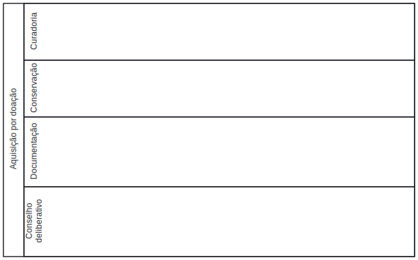

### Eventos

**Eventos são elementos essenciais no BPMN, pois indicam momentos específicos que impactam o fluxo do processo. Esses eventos podem marcar o início, um ponto intermediário ou o final de um processo e são representados por símbolos distintos que ajudam a identificar e organizar o fluxo de trabalho**. Embora na modelagem atual do Obatalá o conceito de evento não tenha sido implementado, sua inclusão pode trazer simplicidade e clareza ao processo, especialmente os eventos de início e fim, que delineiam claramente onde o processo começa e termina.

#### Importância dos eventos de Início e Fim
Os eventos de início e eventos de fim são intuitivos e de fácil implementação. No Obatalá, o evento de início poderia representar a ação inicial que ativa o processo de aquisição ou registro de um item, enquanto o evento de fim indicaria sua conclusão. Essa clareza no início e no fim dos processos ajudaria a todos os envolvidos a compreenderem onde o fluxo começa e termina, estabelecendo um limite claro para a ação dos participantes.

#### Desafios na implementação de outros tipos de evento
Além dos eventos de início e fim, o BPMN oferece uma gama de eventos intermediários, que incluem eventos temporais, de mensagem e de erro. No contexto do Obatalá, onde cada atividade modelada é posteriormente convertida em um formulário a ser preenchido por usuários, a utilização de eventos intermediários exige uma adaptação cuidadosa. Por exemplo:

- **Eventos temporais**: Poderiam ser úteis em processos que exigem aprovação em um tempo específico. No entanto, ao integrar um evento temporal, é necessário que o sistema seja capaz de disparar ações automáticas, caso não aconteça algo dentro do prazo esperado.

- **Eventos de mensagem**: Estes eventos sinalizam trocas de informações entre diferentes etapas ou setores. Na prática, o Obatalá precisaria de uma função para enviar notificações ou avisos entre etapas, alertando os responsáveis quando a próxima ação for necessária.

A implementação desses eventos intermediários no Obatalá dependerá de funcionalidades específicas para monitorar e reagir aos status dos eventos. Cada tipo de evento requer suporte para a automação de notificações e controle de tempo, elementos que demandam desenvolvimento adicional para se integrarem de maneira funcional e eficaz ao fluxo de etapas.

#### Exemplo 1
A figura abaixo mostra um diagrama BPMN com três tipos de eventos: início, intermediário e fim. O evento de início, com borda simples, marca o ponto de partida do processo e pode ser nomeado para descrever sua função inicial. O evento intermediário sinaliza uma etapa de transição e é descrito com verbos no passado, indicando ações já completadas antes do próximo passo. Por fim, o evento de fim, com borda grossa, destaca o encerramento do processo e pode ser nomeado para identificar claramente o objetivo final. Esses eventos delineiam o fluxo de forma clara, proporcionando uma visão completa e organizada do processo.

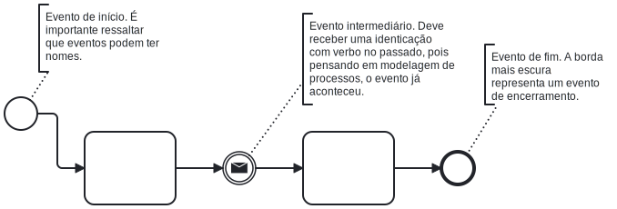

#### Exemplo 2 

No trecho do diagrama BPMN abaixo, para o processo de doação, são utilizados dois eventos para representar pontos-chave no fluxo. Caso o museu decida não prosseguir com o processo de doação, ocorre um evento de finalização com envio de mensagem, que comunica formalmente ao doador a decisão de não dar seguimento. Esse evento encerra o processo, garantindo que o doador seja notificado de maneira adequada. Já o evento intermediário representa um ponto de espera, aguardando o recebimento de uma carta do doador com informações relevantes para o processo. Esse evento de espera indica que o fluxo só avançará após a chegada da documentação, assegurando que as próximas etapas ocorram com base nas informações fornecidas.

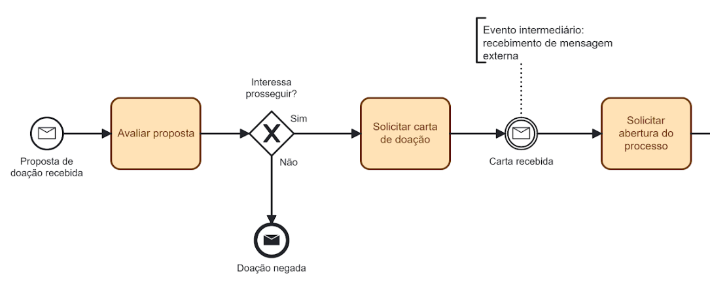

### Atividades
As Atividades são elementos essenciais no BPMN, representando ações específicas que compõem o processo de negócio. Elas são indicadas por retângulos arredondados e podem ser divididas em diferentes tipos, como tarefas e subprocessos. Cada atividade descreve uma etapa que deve ser realizada para que o processo avance, tornando-as fundamentais para estruturar o fluxo e para definir as ações necessárias.

- **Tarefas**: As tarefas representam uma ação única e bem delimitada dentro do processo. São ideais para atividades simples e diretas que não exigem subdivisões. Em um processo de doação, por exemplo, uma tarefa pode ser "Revisar a carta do doador" ou "Registrar a entrada do item no sistema". As tarefas são de fácil visualização e permitem um entendimento rápido do que deve ser feito em cada etapa.

- **Subprocessos**: Quando uma atividade envolve várias ações interconectadas ou é complexa o suficiente para precisar de um detalhamento adicional, ela pode ser representada como um subprocesso. Um subprocesso agrupa várias tarefas menores dentro de uma atividade maior, organizando atividades relacionadas sem sobrecarregar o diagrama principal. Em um processo de doação, um subprocesso poderia representar todas as etapas envolvidas na "Avaliação do Item Doado", contendo tarefas como verificação de estado, documentação e análise de valor cultural.

Além das tarefas e subprocessos, atividades no BPMN podem ser caracterizadas por tipos específicos, como tarefas de usuário, onde uma ação é realizada manualmente por uma pessoa, e tarefas automáticas, executadas pelo sistema sem intervenção humana. Essa flexibilidade permite que as atividades capturem a dinâmica do processo, representando ações diretas, aprovações e atividades automatizadas de forma clara e organizada.

No contexto do Obatalá, atividades modeladas em BPMN que envolvem o preenchimento de formulários podem ser representadas por tarefas de usuário, definindo claramente as ações que cada setor deve completar. A inclusão de atividades bem delineadas facilita o entendimento de cada etapa e o fluxo de responsabilidades, criando um diagrama coeso e eficiente para processos como o de doação de acervo.

#### Tipos de tarefas no BPMN

No BPMN, as tarefas representam atividades fundamentais que compõem o fluxo de um processo de negócios. Cada tipo de tarefa define uma maneira específica de realizar ações no processo, abrangendo desde atividades manuais até aquelas controladas por sistemas automatizados. A escolha do tipo de tarefa adequado não apenas organiza o processo, mas também melhora sua clareza e eficiência, ao especificar o envolvimento necessário de sistemas ou pessoas em cada etapa. Abaixo, apresentamos alguns dos principais tipos de tarefas:

- **Tarefa abstrata (Abstract Task)**: A tarefa abstrata é uma tarefa genérica, sem especificação de tipo. Útil em processos que ainda não requerem detalhamento específico ou em atividades manuais simples, a tarefa abstrata é frequentemente usada quando o tipo de execução não influencia diretamente o fluxo do processo. No BPMN, essas tarefas são indicadas sem um ícone específico, sendo conhecidas também como “none tasks” em versões anteriores.
- **Tarefa de usuário (User Task)**: A tarefa de usuário representa uma atividade executada por uma pessoa com o auxílio de uma aplicação, como um sistema de gerenciamento de processos ou uma lista de trabalho. Esse tipo de tarefa é monitorado pelo sistema, que controla seu início e conclusão antes de avançar para a próxima etapa do processo.
- **Tarefa manual (Manual Task)**: A tarefa manual é realizada no mundo físico, sem o controle direto de um sistema de processos. Ela é executada sem a assistência de aplicações de gerenciamento de workflow e pode incluir atividades que dependem inteiramente da interação humana, como um técnico que verifica manualmente o estado de um equipamento e registra os resultados em papel.
- **Tarefa de serviço (Service Task)**: A tarefa de serviço é uma atividade realizada automaticamente por um sistema, sem intervenção humana. Ela pode envolver operações de sistemas, como a integração com uma base de dados, a consulta de informações externas ou o envio de notificações automáticas. No BPMN, essas tarefas são indicadas com um ícone específico e representam operações que o sistema executa de forma independente.
- **Tarefa com paralelismo (Parallel Task)**: A tarefa com paralelismo é uma atividade que executa ações simultâneas dentro do processo. Usada para otimizar o fluxo e reduzir o tempo de execução, essa tarefa permite que atividades independentes ocorram ao mesmo tempo. No BPMN, geralmente são modeladas com gateways paralelos, onde o fluxo se divide em múltiplas tarefas que podem ser concluídas em paralelo antes de convergir novamente.
- **Subprocesso (Subprocess)**: O subprocesso é uma atividade complexa que contém um conjunto de tarefas agrupadas, permitindo uma estrutura mais organizada e reduzindo a sobrecarga visual do diagrama principal. Ele é útil para processos que exigem múltiplas etapas, pois encapsula ações relacionadas em uma única tarefa, que pode ser expandida para visualizar seu conteúdo. Um exemplo de subprocesso seria “Avaliação de Doação”, contendo várias tarefas como análise de estado, verificação de documentação e consulta de valor histórico.

Esses tipos de tarefas permitem modelar o fluxo de trabalho com o nível adequado de detalhe e especificação, tornando o diagrama BPMN mais claro e eficiente na representação do processo de negócios. Veja uma imagem abaixo com os exemplos de tarefas.

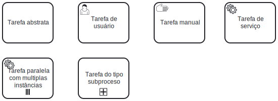

### Gateways
No BPMN, os Gateways são elementos cruciais para o controle do fluxo do processo, pois permitem direcionar o caminho de acordo com condições, decisões ou paralelismos. Representados por losangos, os gateways podem dividir ou combinar fluxos, criando pontos de decisão ou sincronização que orientam a sequência de atividades. Alguns dos tipos mais comuns incluem o gateway exclusivo (XOR), que permite apenas uma saída dependendo de uma condição; o gateway paralelo (AND), que executa múltiplos fluxos simultâneos; e o gateway inclusivo (OR), que permite uma ou mais saídas com base em condições específicas.

#### Desafios para implementação de gateways no Obatalá
Atualmente, o Obatalá ainda não possui gateways implementados, e sua inclusão será uma etapa desafiadora que exigirá uma estrutura robusta. O Obatalá utiliza o React Flow para a construção dos diagramas, uma biblioteca poderosa para fluxos visuais em React, mas que não possui suporte nativo para os gateways complexos definidos pelo BPMN. A implementação dos gateways no Obatalá demandará ajustes no React Flow para suportar as funcionalidades de decisão e paralelismo, além de lógica adicional para interpretar e executar os comportamentos dos gateways de maneira adequada.

Esse desenvolvimento implica na criação de novos componentes ou adaptações no React Flow para que o sistema seja capaz de interpretar condições, decidir caminhos com base em dados e executar tarefas em paralelo quando necessário. Embora desafiador, a introdução de gateways trará maior flexibilidade e precisão ao modelar processos no Obatalá, permitindo que os fluxos de trabalho incluam decisões complexas e caminhos variados, essenciais para processos curatoriais avançados.

#### Tipos de gateways no BPMN
Os gateways são elementos do BPMN que controlam o fluxo de um processo, direcionando-o com base em condições específicas ou criando fluxos paralelos. Existem vários tipos de gateways, cada um com uma função específica, e eles são essenciais para modelar processos complexos onde múltiplos caminhos ou decisões precisam ser tomados. Abaixo estão os gateways mais comuns, acompanhados de exemplos para facilitar a compreensão de suas aplicações.

##### Gateway exclusivo (XOR)
O gateway exclusivo, também chamado de XOR, representa uma decisão onde apenas um caminho pode ser seguido, com base em uma condição específica. Esse gateway é útil quando o processo precisa escolher entre dois ou mais caminhos alternativos, mas apenas um deles será seguido.

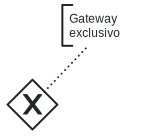

**Exemplo**: No processo de aquisição por doação, se uma peça não atende aos critérios curatoriais, o fluxo segue para uma notificação de recusa ao doador; caso contrário, o fluxo continua para a avaliação de conservação. Aqui, o gateway exclusivo permite que o processo escolha entre os caminhos "Aprovar para Avaliação" e "Recusar Doação" com base na condição da peça. Veja exemplo abaixo.

Veja também um exemplo do funcionamento do gateway exclusivo, evidenciando que apenas um fluxo deve ser seguido após o teste do gateway.

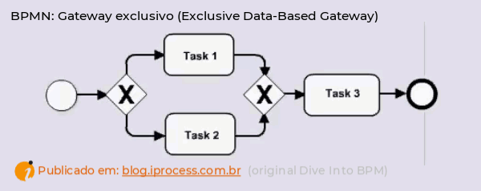

##### Gateway paralelo (AND)
O gateway paralelo, ou AND, permite que múltiplos fluxos ocorram simultaneamente. Em vez de escolher um caminho, o processo executa todas as saídas ao mesmo tempo, aguardando que cada um desses fluxos seja completado antes de seguir adiante.

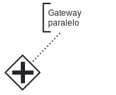

**Exemplo**: Após a aprovação inicial de um item doado, as equipes de Curadoria, Conservação e Documentação podem iniciar suas tarefas simultaneamente. O gateway paralelo libera essas atividades ao mesmo tempo, permitindo que o processo avance em várias frentes e otimizando o tempo de execução.

Veja uma animação de um gateway paralelo que evidencia que todos os fluxos de saída do gateway são executados.

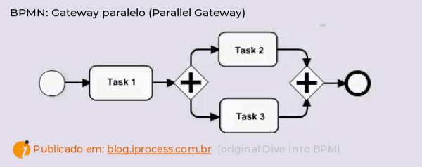

##### Gateway inclusivo (OR)
O gateway inclusivo, ou OR, permite que um ou mais caminhos sejam seguidos simultaneamente, dependendo das condições definidas. Esse tipo de gateway é útil para situações onde múltiplos critérios podem ser atendidos, mas não são todos obrigatórios.

**Exemplo**: No processo de conservação, caso um item exija tanto uma limpeza quanto uma restauração, ambos os fluxos podem ser executados. Se apenas uma das ações for necessária, o processo pode seguir por esse caminho isoladamente. O gateway inclusivo permite escolher entre uma ou ambas as atividades com base nas necessidades do item.

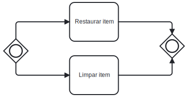

Veja também uma animação sobre o gateway inclusivo que evidencia a possibilidade de um ou mais fluxos serem executados na Figura abaixo.

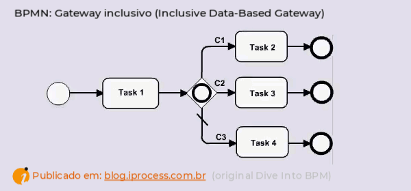

##### Gateway exclusivo baseado em eventos
Esse gateway aguarda que um evento específico ocorra antes de decidir o próximo passo, em vez de uma condição interna do processo. O fluxo segue para o caminho correspondente ao primeiro evento que ocorrer.

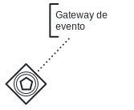

**Exemplo**: No processo de doação, após a avaliação inicial, o fluxo pode seguir por dois caminhos: se uma carta de confirmação do doador é recebida, o processo avança para a documentação; se uma mensagem de desistência é recebida, o fluxo é direcionado para o fechamento do processo. Esse gateway exclusivo baseado em eventos aguarda a chegada de uma dessas mensagens para determinar o próximo passo.

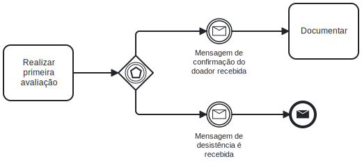

Veja também um exemplo de animação de gateway de evento na Figura abaixo.

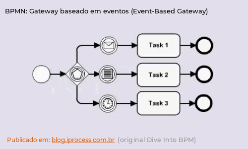

### Conectores (Fluxos)
No BPMN, os fluxos são responsáveis por conectar as atividades, eventos e gateways, orientando o caminho que o processo seguirá. Cada tipo de fluxo serve a um propósito específico e ajuda a definir a sequência e a comunicação entre os elementos no diagrama. Os principais tipos de fluxos no BPMN incluem o fluxo de sequência, o fluxo de mensagem e o fluxo de associação. Abaixo estão descrições e exemplos de cada tipo de fluxo:

#### Fluxo de sequência (Sequence Flow)
O fluxo de sequência é o tipo mais comum e conecta atividades, eventos e gateways dentro do mesmo processo, determinando a ordem em que as ações devem ocorrer. Esse fluxo é representado por uma linha sólida com uma seta, indicando a direção do processo.

**Exemplo**: No processo de doação, o fluxo de sequência conecta a tarefa de “Receber carta do doador” com a tarefa de “Analisar carta”. Esse fluxo indica que, após a recepção da carta, a análise deve ser realizada em sequência.

#### Fluxo de mensagem (Message Flow)
O fluxo de mensagem representa a comunicação entre diferentes participantes ou entidades, como entre departamentos ou sistemas externos. Ele é indicado por uma linha tracejada com uma seta, simbolizando a troca de informações entre pools ou entre um processo interno e externo. O fluxo de mensagem é utilizado para representar trocas de informações que não fazem parte do fluxo contínuo do processo, mas são essenciais para a coordenação.

**Exemplo**: Se o processo de doação envolve uma comunicação com o doador, o fluxo de mensagem conecta o processo do museu a uma notificação externa ao doador para solicitar uma carta de confirmação, permitindo a interação entre as duas partes sem interromper o processo interno do museu.

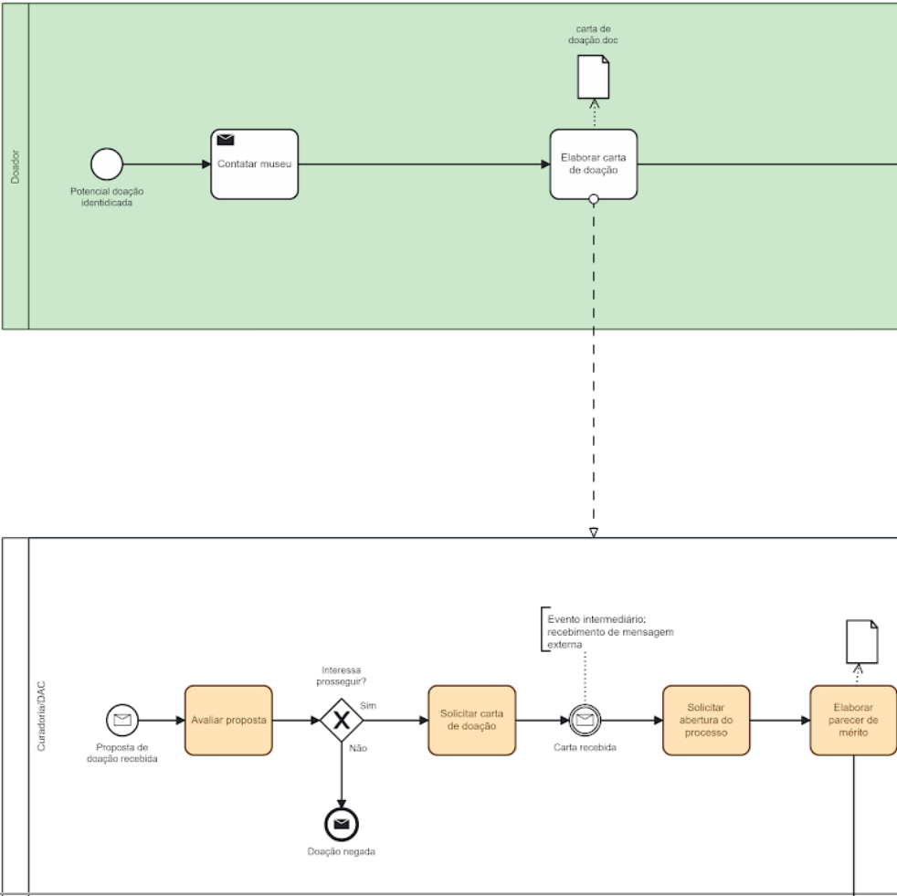

#### Fluxo de associação (Association Flow)
O fluxo de associação é utilizado para conectar informações adicionais, como documentos, notas ou dados, a uma atividade específica. Ele é representado por uma linha pontilhada sem setas e ajuda a associar elementos de documentação ou explicação ao processo sem afetar o fluxo de execução. Esse tipo de fluxo é especialmente útil para agregar informações contextuais.

**Exemplo**: No processo de análise de uma doação, o fluxo de associação pode ligar a tarefa “Analisar carta” a uma anotação que explica o critério de análise ou a um documento que contém informações relevantes sobre a peça doada. Esse fluxo garante que o contexto adicional seja incluído sem alterar a sequência do processo.

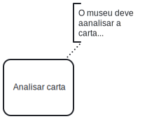

### Artefatos
No BPMN, os Artefatos são elementos que enriquecem o diagrama ao fornecer informações adicionais ou contextualizar o processo, sem interferir diretamente no fluxo do trabalho. Eles ajudam a tornar o diagrama mais claro e detalhado, fornecendo dados que complementam as atividades e interações do processo. Existem três tipos principais de artefatos: Objetos de Dados, Grupos e Anotações.

#### Objetos de dados (Data Objects)
Os objetos de dados representam informações que são criadas, modificadas ou utilizadas durante o processo. Esses artefatos indicam o fluxo de informações entre atividades e podem incluir documentos, relatórios ou formulários. No diagrama, os objetos de dados são representados por ícones que se conectam às atividades com um fluxo de associação, destacando como as informações são manipuladas.

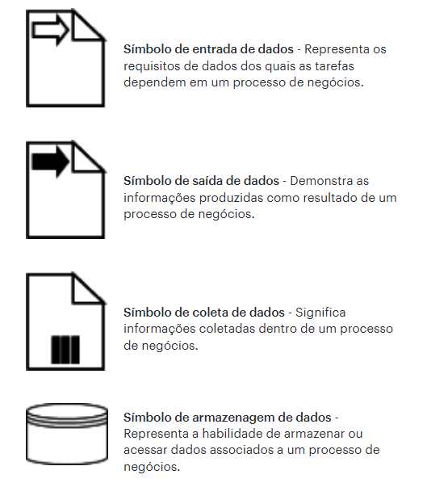

**Exemplo**: No processo de doação, um objeto de dados poderia representar a "Carta de doação" enviada pelo doador. Esse objeto se conecta à atividade “Analisar carta de doação” para indicar que essa informação é essencial para o andamento do processo.

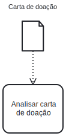

#### Grupos (Groups)
Grupos são usados para organizar visualmente o diagrama, agrupando atividades relacionadas sem impactar o fluxo do processo. Eles são representados por uma área sombreada ou contornada que envolve as atividades, ajudando a identificar partes específicas ou blocos de tarefas que compartilham um propósito comum. Grupos são úteis para destacar subprocessos ou atividades que compõem uma etapa importante, facilitando a leitura do diagrama.

**Exemplo**: Em um processo de aquisição de itens, um grupo pode ser utilizado para agrupar todas as atividades relacionadas à “Avaliação do item”, incluindo tarefas de análise e verificação de documentação. Esse agrupamento visual facilita a compreensão do processo e identifica claramente as tarefas que fazem parte da mesma fase.

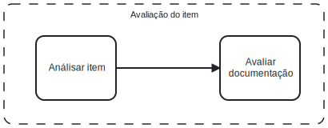

#### Anotações (Annotations)
Anotações são utilizadas para incluir informações explicativas ou contextuais diretamente no diagrama. Representadas por caixas de texto conectadas por linhas pontilhadas às atividades, as anotações permitem descrever regras, critérios ou observações importantes para a compreensão do processo. Elas não alteram o fluxo ou as decisões do processo, mas ajudam quem lê o diagrama a entender melhor cada etapa.

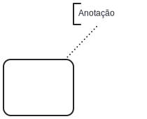

## Material de apoio
Abaixo, temos materiais de pesquisa que podem ser úteis:

- [Especificação BPMN - 2.0.2](pdfs/bmpn-spec.pdf)

## Referências

- Harmon, P. (2014). *Business Process Change: A Business Process Management Guide for Managers and Process Professionals.* Morgan Kaufmann.
- Davenport, T. (1993). *Process Innovation: Reengineering Work through Information Technology.* Harvard Business School Press.
- Weske, M. (2012). *Business Process Management: Concepts, Languages, Architectures.* Springer.
- Hammer, M., & Champy, J. (1993). *Reengineering the Corporation: A Manifesto for Business Revolution.* HarperBusiness.
- Porter, M. E. (1985). *Competitive Advantage: Creating and Sustaining Superior Performance.* Free Press.
- Rummler, G. A., & Brache, A. P. (1990). *Improving Performance: How to Manage the White Space on the Organization Chart.* Jossey-Bass.
- Sharp, A., & McDermott, P. (2009). *Workflow Modeling: Tools for Process Improvement and Application Development.* Artech House.
- Dumas, M., La Rosa, M., Mendling, J., & Reijers, H. A. (2013). *Fundamentals of Business Process Management.* Springer.
